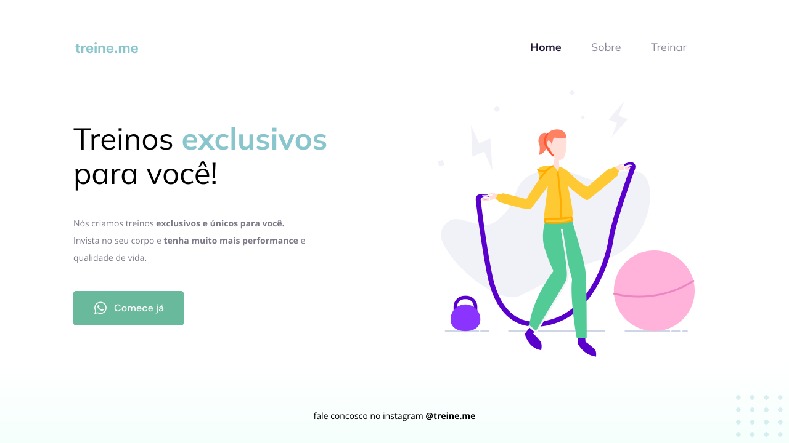

<h1 align="center"> Treine.Me </h1>

Desenvolvido em resposta a um dos desafios da Stade 02 do curso Explorer da Rocketseat.

  <a href="#-tecnologias">Tecnologias</a>&nbsp;&nbsp;&nbsp;|&nbsp;&nbsp;&nbsp;
  <a href="#-projeto">Projeto</a>&nbsp;&nbsp;&nbsp;|&nbsp;&nbsp;&nbsp;
  <a href="#-layout">Layout</a>&nbsp;&nbsp;&nbsp;|&nbsp;&nbsp;&nbsp;
  <a href="#memo-licença">Licença</a>

  

 

  

## 🚀 Tecnologias

Esse projeto foi desenvolvido com as seguintes tecnologias:

- HTML e CSS
- Git e Github
- Figma

## 💻 Projeto

O Treine.me simula um site que disponibiliza treinos personalizados para praticantes de musculação.

## 🔖 Layout

Você pode visualizar o layout do projeto através [DESSE LINK](<https://www.figma.com/file/02uBnjTmjtaJNhib9BZ0Y9/Explorer---Projeto-02-(Copy)?type=design&node-id=0-1&mode=design&t=gy8QaTYRBdOA2rr6-0>). É necessário ter conta no [Figma](https://figma.com) para acessá-lo.

## :memo: Licença

Esse projeto está sob a licença MIT.

---

Feito durante o Discovery da Rocketseat :wave: 